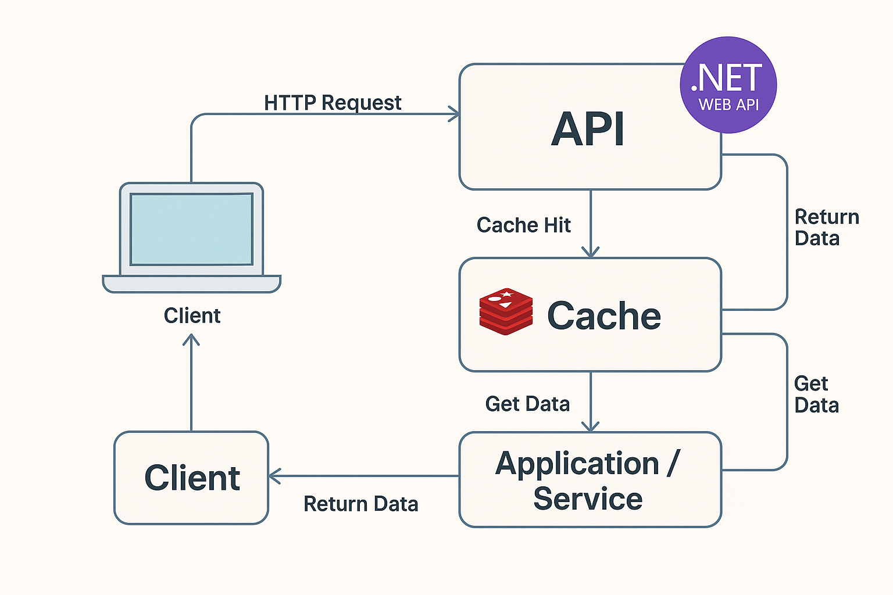

## RestaurantesAPI - Article using .NET WebAPI + Redis

## Using Redis as Cache (Usando Redis como Cache)

<table style="border-style:none;"><tbody><tr><td style="border-style:none;padding:10px;"><p>In contemporary APIs, two mandatory factors are performance and scalability. The exponential and volumetric growth of data, along with the need for real-time response in web applications, makes the use of caching techniques essential to reduce database overload, thereby improving the user experience.</p><p>In what follows, we will design a REST API using ASP.NET Core and Entity Framework Core to retrieve a list of restaurants, incorporating Redis as a caching mechanism. This ensures faster responses and better performance when accessing data.</p><p>You will learn in practice how to build a clean and reusable project that optimizes database queries, configures Redis in ASP.NET, implements cache logic transparently to the user, and fine-tunes your queries to improve performance. This article is aimed at .NET developers who want to adopt new approaches to enhance performance in Web APIs.</p></td><td style="border-style:none;padding:10px;"><p>Em APIs contemporâneas, dois fatores obrigatórios são o desempenho e escalabilidade. O crescimento exponencial e volumétrico de dados, assim como a necessidade de resposta em tempo real em aplicações web tornam essenciais o uso de técnicas de cache para sobrecargas de banco de dados, melhorando a experiência do usuário.</p><p>No que se segue, desenharemos uma API REST com o ASP.NET Core e Entity Framework Core para restaurar uma lista de restaurantes, incorporando o Redis como um mecanismo de cache. Isso assegura respostas mais rápidas e melhor performance ao acessarem os dados.</p><p>Você vai na prática aprender a montar um projeto limpo e reutilizável que otimize as consultas ao banco de dados, configure o Redis no ASP.NET, implemente lógica de cache transparente ao usuário e otimize suas consultas ao banco de dados para aprimorar a performance. Este artigo é voltado para programadores em .NET que queiram incorporar novas abordagens ao rendimento em APIs Web Action</p></td></tr></tbody></table>



## Technologies Used - Tecnologias Empregadas

<table style="border-style:none;"><tbody><tr><td style="border-style:none;padding:10px;"><p>This project was developed using the .NET ecosystem with a focus on best practices in architecture, performance, and scalability. Below, we list the main technologies used:</p><ul><li><strong>ASP.NET Core 8 (Web API):</strong> Modern and cross-platform framework from Microsoft for building RESTful APIs. We used features from version 8.0 to create HTTP endpoints in a clean and efficient way.</li><li><strong>Entity Framework Core 8:</strong> Microsoft's official ORM (Object-Relational Mapper) for data access. Used to map domain entities and manage data persistence in the relational database in a fluent and object-oriented way.</li><li><strong>Pomelo.EntityFrameworkCore.MySql:</strong> Entity Framework Core provider for MySQL databases. It allows us to use EF Core features with a MySQL or MariaDB database natively.</li><li><strong>Redis:</strong> In-memory database, widely used as a distributed caching system. In this project, Redis is responsible for temporarily storing the most frequent queries, reducing the number of database accesses and significantly improving the API response time.</li><li><strong>StackExchange.Redis:</strong> Client library for communication with Redis in .NET. Used to implement read and write operations on the cache in a performant and secure manner.</li><li><strong>Clean Architecture:</strong> The project structure follows the principles of Clean Architecture, promoting the separation of responsibilities across layers (Domain, Application, Infrastructure, and API), making the application easier to maintain, scale, and test.</li></ul><p>This set of technologies provides a solid foundation for developing modern, high-performance APIs that are easy to evolve, catering to both web and mobile applications.</p></td><td style="border-style:none;padding:10px;"><p>Este projeto foi desenvolvido utilizando o ecossistema .NET com foco em boas práticas de arquitetura, performance e escalabilidade. Abaixo, listamos as principais tecnologias utilizadas:</p><ul><li><strong>ASP.NET Core 8 (Web API):</strong> Framework moderno e multiplataforma da Microsoft para construção de APIs RESTful. Utilizamos os recursos da versão 8.0 para criação dos endpoints HTTP de forma limpa e eficiente.</li><li><strong>Entity Framework Core 8:</strong> ORM (Object-Relational Mapper) oficial da Microsoft para acesso a dados. Usado para mapear as entidades de domínio e gerenciar a persistência de dados no banco de dados relacional de forma fluida e orientada a objetos.</li><li><strong>Pomelo.EntityFrameworkCore.MySql:</strong> Provedor do Entity Framework Core para bancos de dados MySQL. Ele nos permite utilizar os recursos do EF Core com um banco MySQL ou MariaDB de maneira nativa.</li><li><strong>Redis:</strong> Banco de dados em memória, amplamente usado como sistema de cache distribuído. Neste projeto, o Redis é responsável por armazenar as consultas mais frequentes de forma temporária, reduzindo o número de acessos ao banco de dados e melhorando significativamente o tempo de resposta da API.</li><li><strong>StackExchange.Redis:</strong> Biblioteca cliente para comunicação com o Redis no .NET. Utilizada para implementar as operações de leitura e escrita no cache de forma performática e segura.</li><li><strong>Clean Architecture:</strong> A estrutura do projeto segue os princípios da Arquitetura Limpa (Clean Architecture), promovendo a separação de responsabilidades entre camadas (Domínio, Aplicação, Infraestrutura e API), facilitando a manutenção, escalabilidade e testabilidade da aplicação.</li></ul><p>Esse conjunto de tecnologias oferece uma base sólida para desenvolvimento de APIs modernas, performáticas e fáceis de evoluir, atendendo tanto aplicações web quanto mobile.</p></td></tr></tbody></table>

## Application Setup Process - Processo de Setup da aplicação

> Considering we are in a Windows operating system environment and Docker Desktop is already installed and running, we can proceed with the following steps.

_Considerando que estamos em um ambiente com sistema operacional **Windows** e que o **Docker Desktop** já está instalado e em execução, podemos seguir com os passos a seguir._

### Installing Redis Locally with Docker Desktop - Instalando Redis localmente com Docker Desktop

> Run the command below to download and start the Redis Server container in your local Docker environment.

Execute o comando abaixo para baixar e iniciar o contêiner do Redis Server no seu ambiente Docker local.

```plaintext
  docker run -d --name redis-server -p 6379:6379 -v redis-data:/data redis
```

### Service Testing

> The command below performs a test to check if Redis is running properly.

O camando abaixo faz um teste para ver se o Redis está em funcionamento

```plaintext
docker exec -it redis-server redis-cli
> SET meuTeste “Bom dia Carlos Vamberto Filho”
> GET meuTest
> exit
```

### Installing MySQL Locally with Docker Desktop

> We will also run MySQL in a container for use in this application. With the command below, we will run MySQL on the default port 3306.

Vamos também rodar em um container o MySQL que usaremos nesta aplicação. Com o comando abaixo vamos rodar o MySQL na porta padrão 3306

```plaintext
docker run --name mysql-local -e MYSQL_ROOT_PASSWORD=Senha123  -p 3306:3306
```

### Creating the Restaurant Table

> I used the MySQL Workbench application to connect to the MySQL server and create the restaurant table in a new database called “meubanco”.

Usei a aplicação MySQL Workbench para me conectar ao servidor do MySQL e criar a tabela de restaurantes em uma nova base de dados chamada “meubanco”

```plaintext
-- Cria o banco de dados se ainda não existir
CREATE DATABASE IF NOT EXISTS meubanco CHARACTER SET utf8mb4 COLLATE utf8mb4_general_ci;
-- Usa o banco de dados
USE meubanco;
-- Criação da tabela restaurantes
CREATE TABLE IF NOT EXISTS restaurantes (
    Id INT AUTO_INCREMENT PRIMARY KEY,
    Nome VARCHAR(255) NOT NULL,
    Tipo VARCHAR(100),
    Endereco VARCHAR(255),
    Cidade VARCHAR(100),
    Regiao VARCHAR(100),
    Pais VARCHAR(100)
);
```

### Inserts records into the Restaurants table

> Here we will create records for 50 existing restaurants in the Algarve region of Portugal to demonstrate the API. Run the script below to insert the records:

Aqui vamos criar registros para 50 restaurantes existentes na região do Algarve em Portugal para demonstrar a API.Execute o script abaixo para inserir os registros:

```plaintext

USE meubanco;

INSERT INTO restaurantes (Nome, Tipo, Endereco, Cidade, Regiao, Pais) VALUES
('Luar da Foia', 'Portuguesa tradicional', 'Estrada da Foia', 'Monchique', 'Algarve', 'Portugal'),
('Petisqueira 3 em Pipa', 'Petiscos', 'Rua do Prior 3', 'Faro', 'Algarve', 'Portugal'),
('Casa da Rocha', 'Marisqueira', 'Praia da Rocha', 'Portimao', 'Algarve', 'Portugal'),
('Sueste', 'Portuguesa tradicional', 'Rua Infante D. Henrique 55', 'Ferragudo', 'Algarve', 'Portugal'),
('Vai e Volta', 'Grelhados de peixe', 'Avenida 5 de Outubro', 'Olhao', 'Algarve', 'Portugal'),
('Matuya Sushi', 'Japonesa', 'Avenida Beira Mar', 'Armacao de Pera', 'Algarve', 'Portugal'),
('Sexy Meat', 'Churrascaria', 'Rua Almeida Garrett', 'Albufeira', 'Algarve', 'Portugal'),
('BJ''s Oceanside', 'Peixes e mariscos', 'Praia do Almargem', 'Quarteira', 'Algarve', 'Portugal'),
('Oliwander''s', 'Portuguesa contemporanea', 'Rua da Porta de Loule', 'Loule', 'Algarve', 'Portugal'),
('Taberna da Mare', 'Petiscos', 'Rua Direita 70', 'Portimao', 'Algarve', 'Portugal'),
('Tasca da Lota', 'Portuguesa tradicional', 'Avenida dos Descobrimentos', 'Lagos', 'Algarve', 'Portugal'),
('Pomò La Pasta Italiana', 'Italiana', 'Rua 25 de Abril', 'Lagos', 'Algarve', 'Portugal'),
('Go Bao', 'Asiatica', 'Rua Conselheiro Joaquim Machado', 'Lagos', 'Algarve', 'Portugal'),
('Gelicia', 'Gelataria', 'Rua Candido dos Reis', 'Lagos', 'Algarve', 'Portugal'),
('Ti Raul', 'Snacks e saudavel', 'Rua da Praia', 'Arrifana', 'Algarve', 'Portugal'),
('Restaurante do Cabrita', 'Marisqueira', 'Rua da Igreja', 'Carrapateira', 'Algarve', 'Portugal'),
('A Sereia', 'Rodizio de peixe', 'Rua Comandante Matoso', 'Sagres', 'Algarve', 'Portugal'),
('O Teodosio', 'Frango piri-piri', 'Rua 25 de Abril', 'Guia', 'Algarve', 'Portugal'),
('Casa do Polvo Tasquinha', 'Polvo e mariscos', 'Rua da Republica', 'Santa Luzia', 'Algarve', 'Portugal'),
('Polvo & Companhia', 'Polvo e mariscos', 'Rua da Liberdade', 'Santa Luzia', 'Algarve', 'Portugal'),
('Ria', 'Peixes e mariscos', 'Anantara Vilamoura', 'Vilamoura', 'Algarve', 'Portugal'),
('Café Correia', 'Marisqueira', 'Rua 1º de Maio', 'Vila do Bispo', 'Algarve', 'Portugal'),
('Bon Bon', 'Gastronomia contemporanea', 'Rua do Monte Carvoeiro', 'Carvoeiro', 'Algarve', 'Portugal'),
('Prato Cheio', 'Portuguesa tradicional', 'Rua Dr. Francisco Sa Carneiro 23A', 'Lagos', 'Algarve', 'Portugal'),
('Casa da Igreja', 'Marisqueira', 'Rua de Cacela Velha 2', 'Cacela Velha', 'Algarve', 'Portugal'),
('Vila Lisa', 'Portuguesa tradicional', 'Rua da Hortinha', 'Portimao', 'Algarve', 'Portugal'),
('O Tonel', 'Portuguesa tradicional', 'Rua Dr. Augusto da Silva Carvalho', 'Tavira', 'Algarve', 'Portugal'),
('Cha Cha Cha', 'Portuguesa contemporanea', 'Rua Vasco da Gama', 'Olhao', 'Algarve', 'Portugal'),
('O Cantinho da Cristina', 'Portuguesa tradicional', 'Rua do Comercio', 'Olhao', 'Algarve', 'Portugal'),
('Restaurante Noelia', 'Peixes e mariscos', 'Avenida Ria Formosa', 'Cabanas de Tavira', 'Algarve', 'Portugal'),
('Restaurante Azenha do Mar', 'Marisqueira', 'Estrada Nacional 120', 'Aljezur', 'Algarve', 'Portugal'),
('Restaurante O Camilo', 'Peixes e mariscos', 'Praia do Camilo', 'Lagos', 'Algarve', 'Portugal'),
('Restaurante O Marinheiro', 'Mediterranea', 'Rua da Torre Velha', 'Albufeira', 'Algarve', 'Portugal'),
('Restaurante O Pescador', 'Peixes e mariscos', 'Rua 5 de Outubro', 'Quarteira', 'Algarve', 'Portugal'),
('Restaurante A Forja', 'Portuguesa tradicional', 'Rua da Barca', 'Portimao', 'Algarve', 'Portugal'),
('Restaurante O Alambique', 'Portuguesa tradicional', 'Estrada Nacional 125', 'Almancil', 'Algarve', 'Portugal'),
('Restaurante O Cais', 'Peixes e mariscos', 'Avenida dos Descobrimentos', 'Vilamoura', 'Algarve', 'Portugal'),
('Restaurante O Galeão', 'Portuguesa tradicional', 'Rua da Praia', 'Armação de Pêra', 'Algarve', 'Portugal'),
('Restaurante A Tasca', 'Petiscos', 'Rua do Comércio', 'Loulé', 'Algarve', 'Portugal'),
('Restaurante O Farol', 'Peixes e mariscos', 'Praia do Farol', 'Ilha do Farol', 'Algarve', 'Portugal'),
('Restaurante O Pátio', 'Portuguesa tradicional', 'Rua das Flores', 'Tavira', 'Algarve', 'Portugal'),
('Restaurante O Barril', 'Peixes e mariscos', 'Praia do Barril', 'Tavira', 'Algarve', 'Portugal'),
('Restaurante O Zé', 'Portuguesa tradicional', 'Rua da Alegria', 'Faro', 'Algarve', 'Portugal'),
('Restaurante O Pescador', 'Peixes e mariscos', 'Rua da Praia', 'Quarteira', 'Algarve', 'Portugal'),
('Restaurante A Marisqueira', 'Marisqueira', 'Avenida Marginal', 'Lagos', 'Algarve', 'Portugal'),
('Restaurante O Grelhador', 'Grelhados', 'Rua do Sol', 'Portimão', 'Algarve', 'Portugal'),
('Restaurante O Forno', 'Portuguesa tradicional', 'Rua do Forno', 'Silves', 'Algarve', 'Portugal'),
('Restaurante A Taberna', 'Petiscos', 'Rua da Taberna', 'Albufeira', 'Algarve', 'Portugal'),
('Restaurante O Barco', 'Peixes e mariscos', 'Avenida do Mar', 'Olhão', 'Algarve', 'Portugal'),
('Restaurante O Pátio das Laranjeiras', 'Portuguesa tradicional', 'Rua das Laranjeiras', 'Loulé', 'Algarve', 'Portugal');
```

## Clean Architecture

> **Clean Architecture**, proposed by Robert C. Martin (known as Uncle Bob), is an architectural style that aims to organize the code in such a way that the application's business rules are independent of frameworks, external libraries, databases, and user interfaces.
> 
> Its main goal is to promote **separation of concerns, maintainability, testability,** and **scalability**. To achieve this, the architecture is divided into well-defined layers, each with a specific role:
> 
> *   **Domínio (Entities):** contains the core business rules of the application.
> *   **Casos de uso (Use Cases/Application):** orchestrates the application's behavior and specific business rules.
> *   **Interface de entrada (InterfaceAdapters/API):** handles incoming requests (e.g., API controllers).
> *   **Infraestrutura (Infrastructure):** implements technical details such as database access, external services, caching, etc.
> 
> One of the main advantages of Clean Architecture is **technology independence**. This means that, for example, it's possible to change the database (from SQL Server to MySQL, or Redis for caching) without affecting the business rules.
> 
> Adopting Clean Architecture helps development teams build more organized, decoupled, and easy-to-evolve systems—essential characteristics for modern applications, especially when considering scalable REST APIs, as proposed in this article.

A **Clean Architecture**, proposta por Robert C. Martin (conhecido como Uncle Bob), é um estilo arquitetural que busca organizar o código de forma que as regras de negócio da aplicação sejam independentes de frameworks, bibliotecas externas, banco de dados e interfaces de usuário.

Seu principal objetivo é promover **separação de responsabilidades**, **facilidade de manutenção**, **testabilidade** e **escalabilidade**. Para isso, a arquitetura é dividida em camadas bem definidas, onde cada uma possui seu papel específico:

*   **Domínio (Entities):** contém as regras de negócio mais centrais da aplicação.
*   **Casos de uso (Use Cases/Application):** orquestra o comportamento da aplicação e as regras específicas de negócio.
*   **Interface de entrada (InterfaceAdapters/API):** recebe as requisições (ex: controllers da API).
*   **Infraestrutura (Infrastructure):** implementa detalhes técnicos como acesso ao banco de dados, serviços externos, cache etc.

Uma das principais vantagens da Clean Architecture é a **independência de tecnologia**. Isso significa que, por exemplo, é possível trocar o banco de dados (de SQL Server para MySQL, ou para Redis como cache) sem afetar as regras de negócio.

Adotar Clean Architecture ajuda times de desenvolvimento a construírem sistemas mais organizados, desacoplados e fáceis de evoluir — características essenciais para aplicações modernas, especialmente quando pensamos em APIs REST escaláveis, como a proposta deste artigo.

## Visual Studio 2022

> Now let's create a blank solution named **RestaurantesAPI** in Visual Studio 2022 and add the following projects:

Agora vamos criar uma solução em Branco de nome **RestauratesAPI** no Visual Studio 2022 e adicionar o seguintes projetos:

1.  **Restaurantes.Application** – Class Library - .NET 8
2.  **Restaurantes.Domain** – Class Library - .NET 8
3.  **Restaurantes.Infrastructure** – Class Library - .NET 8
4.  **Restaurantes.API** – ASP.NET Core Web API - .NET 8

### Restaurantees.Domain

> Create the **Restaurante.cs** class in the **Entities** folder.

Crie a classe **Restaurante.cs** na pasta **Entities**

```cs
namespace Restaurantes.Domain.Entities
{
    public class Restaurante
    {
        public int Id { get; set; }
        public string Nome { get; set; }
        public string Tipo { get; set; }
        public string Endereco { get; set; }
        public string Cidade { get; set; }
        public string Regiao { get; set; }
        public string Pais { get; set; }
    }
}
```

> Create the **IRestauranteRepository.cs** interface in the **Interfaces** folder.

Crie a Interface **IrestauranteRepository.cs** na pasta **Interfaces**

```cs
using Restaurantes.Domain.Entities;

namespace Restaurantes.Domain.Interfaces
{
    public interface IRestauranteRepository
    {
        Task<IEnumerable<Restaurante>> GetFilteredAsync(string? nome, string? tipo, string? cidade);
    }
} 
```

### Restaurantes.Application

> In **Restaurantes.Application**, add a **Project Reference** to the **Restaurantes.Domain** project by right-clicking on the **Restaurantes.Application** project and selecting **Add → Project Reference...**  
> Add the following **IRestauranteService.cs** interface below in the **Services** folder.

No Restaurantes.Application, adicione um **Project Reference** para o projeto **Restaurantes.Domain** usando o botão direito do mouse sobre o projeto **Restaurantes.Application** escolhendo **Add à Project Reference...**

Adicione a seguinte interface **IrestauranteService.cs** abaixo na pasta **Services**.

```cs
using Restaurantes.Application.Requests;
using Restaurantes.Domain.Entities;

namespace Restaurantes.Application.Services
{
    public interface IRestauranteService
    {
        Task<IEnumerable<Restaurante>> GetFilteredAsync(GetRestaurantesRequest request);
    }
}
```

> Create a class named **GetRestaurantesRequest.cs** in the **Requests** folder.

Crie uma classe na pasta **Requests** de nome **GetRestaurantesRequest.cs**

```cs
namespace Restaurantes.Application.Requests
{
    public class GetRestaurantesRequest
    {
        public string? Nome { get; set; }
        public string? Tipo { get; set; }
        public string? Cidade { get; set; }
    }
}
```

### Restaurant.Infrastructure Project

> Add a **Project Reference** in **Restaurantes.Infrastructure** to the **Restaurantes.Application** project.
> 
> Using **NuGet**, add the **Microsoft.Extensions.Caching.StackExchangeRedis** package to the **Restaurantes.Infrastructure** project.
> 
> Add the **MyDbContext.cs** class in the **Context** folder.

Adicione um **Project Reference** no **Restaurantes.Infrastructure** para o projeto **Restaurantes.Application**  
Usando o **Nuget** adicione o pacote **Microsoft.Extensions.Caching.StackExchangeRedis** no projeto **Restaurantes.Infrastructure**  
Adicione a classe **MyDbContext.cs** na pasta **Context**

```cs
using Microsoft.EntityFrameworkCore;
using Restaurantes.Domain.Entities;

namespace Restaurantes.Infrastructure.Context
{
    public class MyDbContext : DbContext
    {
        public MyDbContext(DbContextOptions<MyDbContext> options) : base(options) { }

        public DbSet<Restaurante> Restaurantes { get; set; }

        protected override void OnModelCreating(ModelBuilder modelBuilder)
        {
            modelBuilder.Entity<Restaurante>().ToTable("restaurantes");
        }
    }
}
```

> Create the **RestauranteRepository.cs** class that will implement the **IRestauranteRepository.cs** interface.

Crie a classe **RestauranteRepository.cs** que vai implementar a interface **RestauranteRepository.cs**

```cs
using Microsoft.EntityFrameworkCore;
using Restaurantes.Domain.Entities;
using Restaurantes.Domain.Interfaces;
using Restaurantes.Infrastructure.Context;

namespace Restaurantes.Infrastructure.Repositories
{
    public class RestauranteRepository : IRestauranteRepository
    {
        private readonly MyDbContext _context;

        public RestauranteRepository(MyDbContext context)
        {
            _context = context;
        }

        public async Task<IEnumerable<Restaurante>> GetFilteredAsync(string? nome, string? tipo, string? cidade)
        {
            var query = _context.Restaurantes.AsQueryable();

            if (!string.IsNullOrEmpty(nome))
                query = query.Where(r => r.Nome.Contains(nome));
            if (!string.IsNullOrEmpty(tipo))
                query = query.Where(r => r.Tipo.Contains(tipo));
            if (!string.IsNullOrEmpty(cidade))
                query = query.Where(r => r.Cidade.Contains(cidade));

            return await query.ToListAsync();
        }
    }
}
```

### Restaurantes.API Project

> Add a **Project Reference** in the **Restaurantes.API** project to the **Restaurantes.Infrastructure** project.  
> Add the following **ConnectionStrings** section to the **appsettings.json** file.

Adicione uma **Project Reference** no projeto **Restaurantes.API** para o projeto **Restaruantes.Infrastrucure**  
Adicione o código abaixo relacionado a **ConnectionStrings** dentro do arquivo **appsettings.json**

```javascript
"ConnectionStrings": {
  "Redis": "localhost:6379",
  "DefaultConnection": "server=localhost;port=3306;database=meubanco;user=root;password=Senha123"
} 
```

> Add the code below in the **Program.cs** class before the line `var app = builder.Build();`.

Adicione o código abaixo na classe **Program.cs** antes da linha `var app = builder.Build();`.

```cs
// Configura a conexão com a base de dados MySQL
builder.Services.AddDbContext<MyDbContext>(options =>
    options.UseMySql(
        builder.Configuration.GetConnectionString("DefaultConnection"),
        ServerVersion.AutoDetect(builder.Configuration.GetConnectionString("DefaultConnection"))
    )
);

// Configura o Redis como cache distribuído
builder.Services.AddStackExchangeRedisCache(options =>
{
    options.Configuration = builder.Configuration.GetConnectionString("Redis");
    options.InstanceName = "RestaurantesCache:";
});

// Configura a injeção de dependências para o repositório e serviço de restaurantes
builder.Services.AddScoped<IRestauranteRepository, RestauranteRepository>();
builder.Services.AddScoped<IRestauranteService, RestauranteService>();
```

### Creating the Restaurantes API Endpoint.

> In the **Controllers** folder, create the **RestaurantesController.cs** controller.

Na pasta **Controllers** crie o controller **RestaurantesController.cs**

```cs
using Microsoft.AspNetCore.Mvc;
using Restaurantes.Application.Requests;
using Restaurantes.Application.Services;
using Restaurantes.Domain.Entities;

namespace Restaurantes.API.Controllers
{
    [Route("api/[controller]")]
    [ApiController]
    public class RestaurantesController : ControllerBase
    {
        private readonly IRestauranteService _restauranteService;

        public RestaurantesController(IRestauranteService restauranteService)
        {
            _restauranteService = restauranteService;
        }

        /// <summary>
        /// Lista restaurantes com base nos filtros fornecidos (Nome, Tipo e Cidade).
        /// </summary>
        [HttpGet]
        public async Task<ActionResult<IEnumerable<Restaurante>>> Get(
            [FromQuery] string? nome, [FromQuery] string? tipo, [FromQuery] string? cidade)
        {
            var request = new GetRestaurantesRequest
            {
                Nome = nome,
                Tipo = tipo,
                Cidade = cidade
            };

            var result = await _restauranteService.GetFilteredAsync(request);

            return Ok(result);
        }
    }
}
```

## **Final Considerations**

> In this article, we explored the creation of a **REST API** using **.NET** and the application of **Redis** as a caching mechanism to optimize performance in data queries. We adopted **Clean Architecture** as the structural foundation of the project, ensuring a cleaner, more modular, and easier-to-maintain organization.
> 
> Throughout the development, it was clear how the use of **Redis** significantly contributes to reducing the API's response time, especially in scenarios where the data doesn't change frequently. Additionally, the separation of concerns promoted by Clean Architecture facilitates testability, system evolution, and the replacement of technologies without major impacts on the core of the application.
> 
> This approach is highly recommended for projects that require scalability and long-term maintenance, such as recommendation systems, product catalogs, or — as we saw — restaurant queries.
> 
> The combined use of modern practices, such as dependency injection, **Entity Framework Core**, and **Redis**, demonstrates how it's possible to build robust, high-performance solutions within the **.NET** ecosystem.

Neste artigo, exploramos a criação de uma **API REST** utilizando **.NET** e a aplicação do **Redis** como mecanismo de cache para otimizar a performance nas consultas de dados. Adotamos a **Clean Architecture** como base estrutural do projeto, garantindo uma organização mais limpa, modular e fácil de manter.

Ao longo do desenvolvimento, foi possível perceber como o uso do **Redis** contribui significativamente para a redução do tempo de resposta da API, especialmente em cenários onde os dados não mudam com frequência. Além disso, a separação de responsabilidades promovida pela Clean Architecture facilita a testabilidade, a evolução do sistema e a substituição de tecnologias sem grandes impactos no núcleo da aplicação.

Essa abordagem é altamente recomendada para projetos que exigem escalabilidade e manutenção a longo prazo, como sistemas de recomendação, catálogos de produtos ou — como vimos — consultas de restaurantes.

O uso combinado de práticas modernas, como injeção de dependência, **Entity Framework Core** e **Redis**, demonstra como é possível construir soluções robustas e de alta performance com o ecossistema **.NET**.
